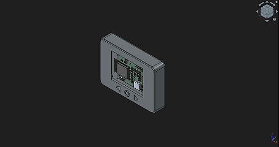
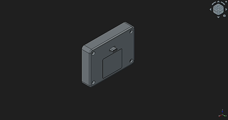
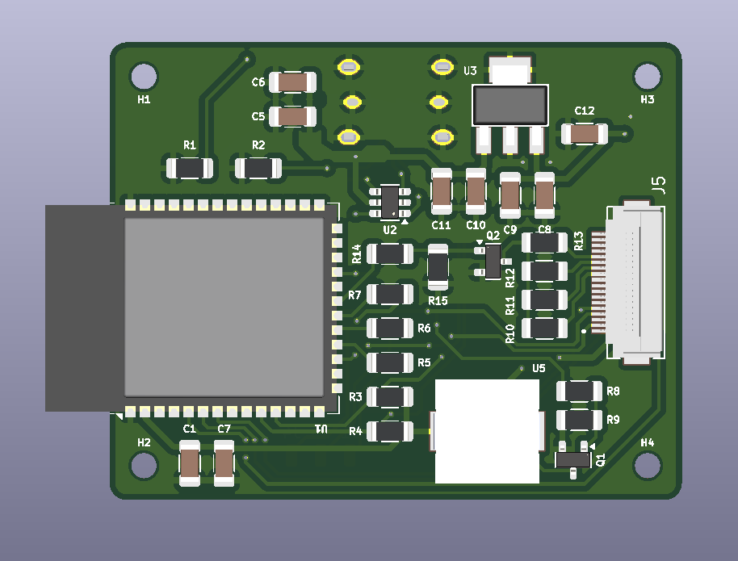
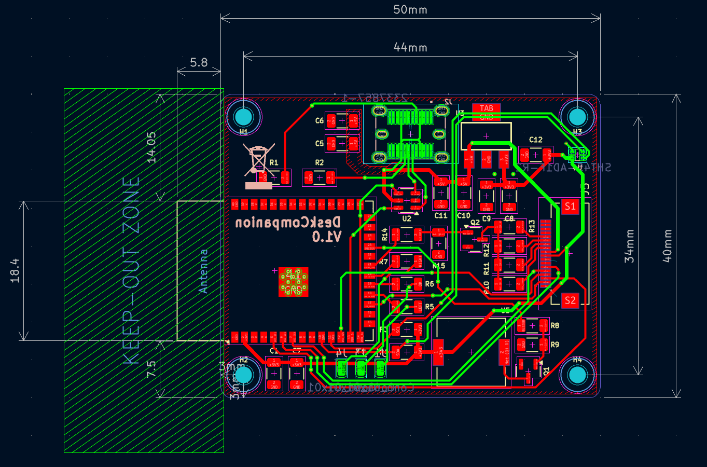

# DeskCompanion

ESP32-based desk device for a clock, Pomodoro timer and PC media information. This version brings together a custom PCB designed in KiCad and an enclosure modelled in FreeCAD.

**Status: in development.** The PCB has not been manufactured and the enclosure has not been printed. The images below show the digital design.

## Enclosure

The enclosure includes a display opening, front controls, PCB mounting points and a folding stand.

Rear exploded view

## PCB

Custom ESP32 board with USB-C power and a display connector. The PCB outline shown in the layout is 50 × 40 mm.

PCB layout

## Progress

| Part | Current state |
| --- | --- |
| PCB | Layout and 3D render available; fabrication and electrical testing pending. |
| Enclosure | CAD model and assembly animations available; printing and fit checks pending. |
| Firmware | Source files and build instructions to be added. |
| Complete device | Assembly and validation on the custom hardware pending. |

## Repository structure

| Folder | Contents |
| --- | --- |
| [`firmware/`](firmware/) | Reserved for ESP32 firmware. |
| [`hardware/`](hardware/) | Reserved for KiCad source files and fabrication outputs. |
| [`mechanical/`](mechanical/) | Reserved for FreeCAD files and printable parts. |
| [`docs/media/`](docs/media/) | PCB images and enclosure animations. |

This initial version contains documentation and design previews. Firmware, schematics, PCB source files and CAD files have not been uploaded yet.

## Next steps

- Review the PCB and enclosure before fabrication.
- Manufacture and assemble the PCB; print the enclosure.
- Check power rails, programming, display operation and controls.
- Verify mechanical fit and document the test results.
